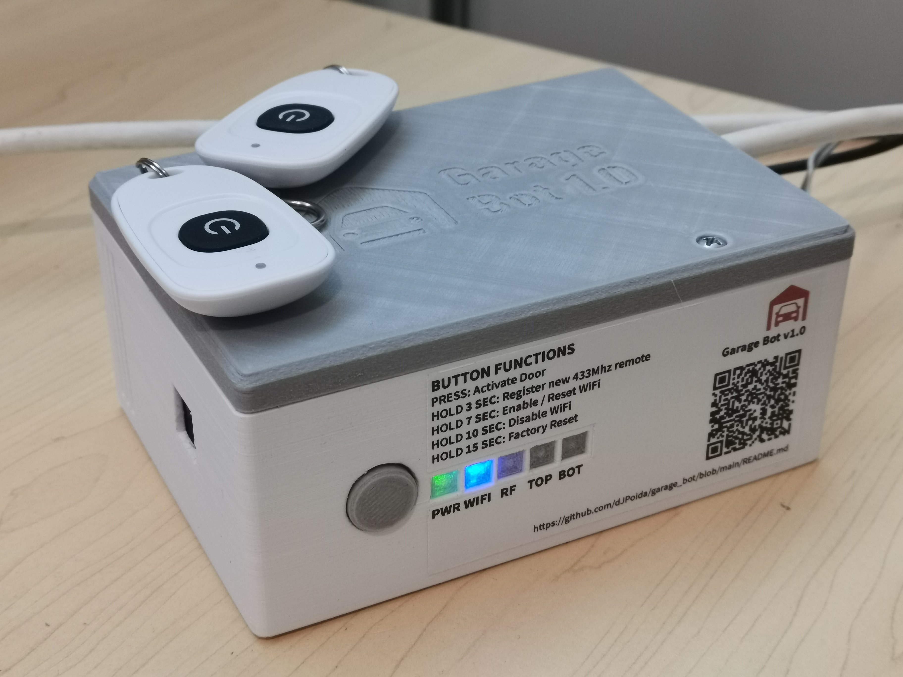
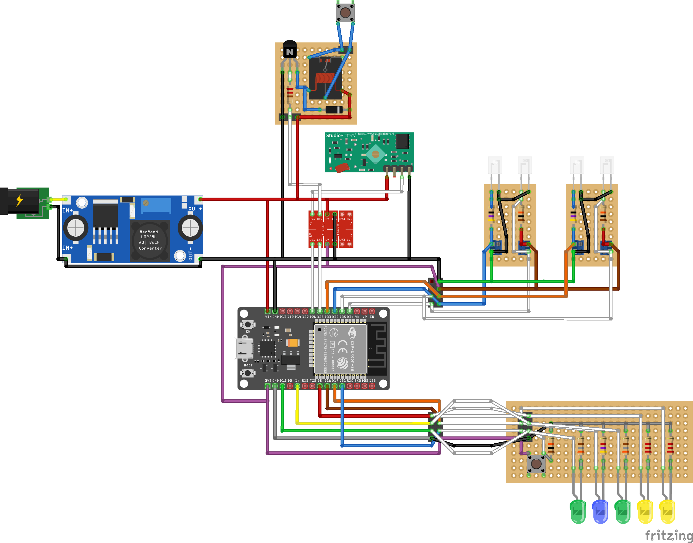
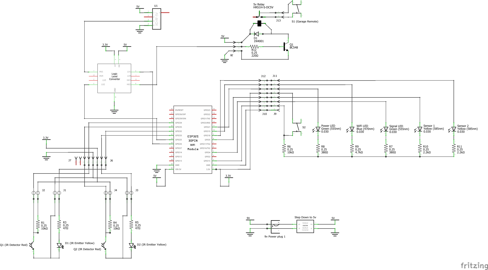

# GarageBot v1.0
This project adds some form of IoT capability to my existing garage door.



## Back Story
At the time of creating this project, we were renting our house. This limited our ability to implement smart technology or change out hardware. For over two years our landlord had not supplied us with a second remote control for the garage door, meaning my wife and I had to plan who was going to take the remote with us based on who was likely to be home first. Couple that with frequent incidents of accidentally leaving the garage door open at night, and voila, I had motivation to improve our garage door situation.

## Goals
- End up with a remote control in each car (2x remotes)
- Provide a capability to open / close the garage door from within the house
- Enable Google Home integration
    - Open / Close commands
    - Open / Closed query
- Avoid drastic modification of the garage door to ensure we don't break our lease agreement when it's time to turn over the remote controls

## Getting Started
This is the Link that the QR Code on the device points to. When the new tenant at our property discovers and scans the QR code, they will end up here. Welcome! Read on for instructions on how to operate the device.

## Device Operation

### Front panel button operation
There is only one button on the device. Once pressed, this button will perform a different operation depending on how long it is depressed for:

- **< 1s**: Activate the garage door (open / close / stop)
- **3s**: [Register a new 433Mhz remote](#registering-a-new-remote)
- **7s**: [Enable the WiFi and Reset the WiFi config](#connecting-the-device-to-your-wifi)
- **10s**: [Disable the WiFi and Reset the WiFi config](disabling-the-wifi-functionality)
- **15s**: Perform a full factory reset

### Registering a new Remote

To pair a new 433Mhz remote:

1. Hold down the front panel button on the GarageBot and release it after **3 seconds**.
2. Check that the RF LED (the third LED) is blinking in an *on-on-on-off* pattern. This indicates that the GarageBot is ready to register a new remote. If the Power LED begins to flash in an `on-off` pattern, you have most likely reached the maximum number of 5 registered RF remotes and the device will need to be factory reset to register any new remotes.
3. Hold down the button on the new remote for at least **1s** until all of the lights on the device activate for 3 seconds, indicating a successful registration.

**Important Notes:**
- The remote must use the 433Mhz band
- The remote must use [Amplitude-shift keying (ASK)](https://en.wikipedia.org/wiki/Amplitude-shift_keying) for signal modulation
- You can only register **5 unique remote codes**. Once this limit has been reached, you must factory reset your device to register new remotes.

### Connecting the device to your WiFi
The GarageBot can be connected to your Wifi to either become part of your smart home or to be controlled directly via a web interface.

To connect the GarageBot to your WiFi:

1. Hold down the front panel button on the GarageBot and release it after **7 seconds**.
2. Any existing WiFi details will be cleared and the GarageBot will reboot.
3. Once rebooted, check that the WiFi LED (the second LED) is blinking in an *on-on-on-off* pattern. This indicates that the device is now broadcasting a HotSpot and is ready for WiFi configuration
4. Using a WiFi enabled device (mobile phone, tablet, laptop etc...) scan for available WiFi networks. If you are within range of the GarageBot, you should be able to see the `garagebot` WiFi network.
5. Connect your device to the `garagebot` network. Your device may immediately take you to the GarageBot WiFi configuration page. If not, open a browser and browse to `http://192.168.4.1`.
6. Enter the WiFi SSID and Password of your local WiFi network and click `Submit`.
7. The GarageBot will save the new WiFi details, reboot and attempt to connect to your WiFi network.
8. If the WiFi details were successfully registered and the device was able to connect, the blue WiFi LED (the second LED) will no longer blink and will remain on for as long as the device can access the WiFi network.

Once the GarageBot is connected to your WiFi, you can access it using the url: [http://garagebot.local](http://garagebot.local).


### Disabling the WiFi functionality
If for any reason you want to disable the WiFi functionality of the device, you can do so by following this procedure:

1. Hold down the front panel button on the GarageBot and release it after **10 seconds**.
2. Any existing WiFi details will be cleared, the WiFi functionality will be disabled and the GarageBot will reboot.
3. If the WiFi was successfully disabled, the blue WiFi LED (the second LED) will no longer be illuminated.

### Performing a Factory Reset
If you would like to perform a full factory reset and clear all of the configurations of the device, you can do so by following this procedure:

1. Hold down the front panel button on the GarageBot and release it after **15 seconds**.
2. All of the existing configuration will be cleared and the device will reboot.
2. If the factory reset was successful, all of the LED Lights will light up momentarily just before the reboot of the device.

## LED Lights
There are five LED lights on the GarageBot.

### 1. Power (PWR)
This LED Indicates that the device is on. When holding down the front panel button, this LED will flash in an `on-off` repeating pattern where each `on-off` cycle is 1 second to assist with counting the number of seconds elapsed.

### 2. WiFi
This LED indicates the state of the device's WiFi connection.
- Off: WiFi is not yet enabled
- Solid On: WiFi connected
- Flashing `on-on-on-off`: Broadcasting hot-spot for [WiFi configuration](#connecting-the-device-to-your-wifi)

### 3. Remote Activation (RF)
This LED indicates any RF activity or garage door remote activation.
- Solid On: Activating the legacy Garage Door remote via relay.
- Flashing `on-on-on-off`: [Registering a new remote](#registering-a-new-remote)
- Flashing `on-off`: Error while registering a new remote (most likely the remote registration count of 5 remotes has been exceeded)

### 4. Garage Door Top Sensor (TOP)
This LED indicates whether the top sensor on the garage door can detect the presence of the door.
- Off: Door is detected (i.e. closed)
- On: Door cannot be detected (i.e. open)

### 5. Garage Door Bottom Sensor (BOT)
This LED indicates whether the bottom sensor on the garage door can detect the presence of the door.
- Off: Door is detected (i.e. closed)
- On: Door cannot be detected (i.e. open)

## Home Assistant integration
If you want to integrate with [Home Assistant](https://www.home-assistant.io/) then you can use the `garage_door.yaml` configuration to create a simple `cover` control.

Simply modify `configuration.yaml` and add
```
cover: !include garage_door.yaml
```

## Google Home integration
If you want to integrate the garage door with Google Home for voice commands, follow [JuanMTech's Guide on integrating Google Assistant with Home Assistant](https://www.juanmtech.com/integrate-google-assistant-with-home-assistant-without-a-subscription)

---

## System Design


## Schematic



---

## Contributing

If you want to contribute to this repo, feel free!

### Environments
There are two main environments, the Arduino code that runs the ESP32 and the React web application that runs the WiFi control / setup page.

#### Arduino IDE


#### Visual Studio Code
To work on the Web App you will need the standard [Node.js](https://nodejs.org) kit to develop JS/TS applications.
- The app codebase is located in the `/app` path
- This project was setup using the [yarn package manager](https://yarnpkg.com/), but would still work using NPM if you prefer
- This project uses a custom webpack configuration for build / deploy
```
git clone https://github.com/dJPoida/garage_bot.git
cd app
yarn
yarn start
```
Browse to `http://localhost:3000` to view the app.

**Important note!:** At the time of writing this documentation no device emulator existed. Therefore, the device must be running before the web socket will confirm connection and display the app.

If you want to publish new code to be served from the device, run the build task and the bundle will be created in the `/app/dist` folder and automatically copied into the `/arduino/garage_bot/data` folder for upload using the ESP Sketch Data Upload utility to the device SPIFFS.

```
yarn build
```

---

## Developer TODO
- REST API
    - Provide access to activate Virtual Buttons from an HTTP POST endpoint (perhaps add credentials)
- Documentation
    - Provide a BOM so people can build this themselves
    - Improve CAD and Schematic documentation
    - Improve contribution documentation
        - Describe system dependencies for environments
        - Provide device emulation documentation
- Create a Device Emulator for web app development

