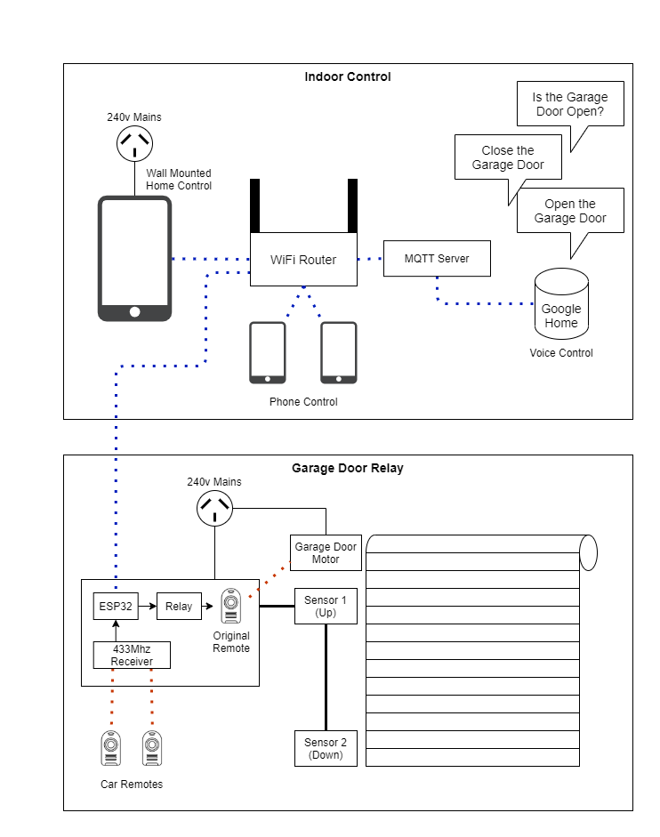

# Garage Bot v1.0
This project adds some form of IoT capability to my existing garage door.

## Back Story
At the time of creating this project, we're renting our house. This limits my ability to implement smart technology or change out hardware. For over two years our landlord has not supplied us with a second remote control for the garage door, meaning my wife and I have to plan who is going to take the remote with us based on who is likely to be home first. Couple that with frequent incidents of accidentally leaving the garage door open at night, and voila, motivation to improve our garage door situation.

## Goals
- Provide 2x remote controls for each car
- Provide a mechanism for opening / closing the garage door from within the house
- Connect the controller to Home Assistant via MQTT
- Enable Google Home integration
    - Open / Close commands
    - Open / Closed query
- Avoid drastic modification of the garage door to ensure we don't break our lease agreement when it's time to turn over the remote controls

## System Design

## Getting Started
TODO: This is the Link that the QR Code on the device points to.

## Device Operation

### Front panel button operation
There is only one button on the device. Once pressed, this button will perform a different operation depending on when it is released:

- **< 1s**: Activate the garage door
- **3s**: Register a new 433Mhz remote
- **7s**: Enable the WiFi and Reset the WiFi config
- **10s**: Disable the WiFi and Reset the WiFi config
- **15s**: Perform a full factory reset

### Registering a new Remote

**Important Notes:**
- The remote must use the 433Mhz band
- The remote must use [Amplitude-shift keying (ASK)](https://en.wikipedia.org/wiki/Amplitude-shift_keying) as its modulation
- You can only register 5 unique remote codes. Once this limit has been reached, you must factory reset your device to register new remotes.

To pair a new 433Mhz remote:

1. Hold down the front panel button on the Garage Bot and release it after **3 seconds**.
2. Check that the RF LED (the third LED) is blinking in an *on-on-on-off* pattern. This indicates that the Garage Bot is ready to register a new remote. If the Power LED begins to flash in an `on-off` pattern, you have most likely reached the maximum number of 5 registered RF remotes and the device will need to be factory reset to register any new remotes.
3. Hold down the button on the new remote for at least **1s** until all of the lights on the device activate for 3 seconds, indicating a successful registration.

### Connecting the device to your WiFi
The Garage Bot can be connected to your Wifi to either become part of your smart home or to be controlled directly via a web interface.

To connect the Garage Bot to your WiFi:

1. Hold down the front panel button on the Garage Bot and release it after **7 seconds**.
2. Any existing WiFi details will be cleared and the Garage Bot will reboot.
3. Once rebooted, check that the WiFi LED (the second LED) is blinking in an *on-on-on-off* pattern. This indicates that the device is now broadcasting a HotSpot and is ready for WiFi configuration
4. Using a WiFi enabled device (mobile phone, tablet, laptop etc...) scan for available WiFi networks. If you are within range of the Garage Bot, you should be able to see the `garagebot` WiFi network.
5. Connect your device to the `garagebot` network. Your device may immediately take you to the Garage Bot WiFi configuration page. If not, open a browser and browse to `http://192.168.4.1`.
6. Enter the WiFi SSID and Password of your local WiFi network and click `Submit`.
7. The Garage Bot will save the new WiFi details, reboot and attempt to connect to your WiFi network.
8. If the WiFi details were successfully registered and the device was able to connect, the blue WiFi LED (the second LED) will no longer blink and will remain on for as long as the device can access the WiFi network.

Once the Garage Bot is connected to your WiFi, you can access it using the url: [http://garagebot.local](http://garagebot.local).

### Disabling the WiFi functionality
If for any reason you want to disable the WiFi functionality of the device, you can do so by following this procedure:

1. Hold down the front panel button on the Garage Bot and release it after **10 seconds**.
2. Any existing WiFi details will be cleared, the WiFi functionality will be disabled and the Garage Bot will reboot.
3. If the WiFi was successfully disabled, the blue WiFi LED (the second LED) will no longer be illuminated.

## LED Lights
There are five LED lights on the Garage Bot.

### 1. Power (PWR)
This LED Indicates that the device is on. When holding down the front panel button, this LED will flash in an `on-off` repeating pattern where each `on-off` cycle is 1 second to assist with counting the number of seconds elapsed.

### 2. WiFi
This LED indicates the state of the device's WiFi connection.
- Off: WiFi is not yet enabled
- Solid On: WiFi connected
- Flashing `on-on-on-off`: Broadcasting hot-spot for [WiFi configuration](#connecting-the-device-to-your-wifi)

### 3. Remote Activation (RF)
This LED indicates any RF activity or garage door remote activation.
- Solid On: Activating the legacy Garage Door remote via relay.
- Flashing `on-on-on-off`: [Registering a new remote](#registering-a-new-remote)
- Flashing `on-off`: Error while registering a new remote (most likely the remote registration count of 5 remotes has been exceeded)

### 4. Garage Door Top Sensor (TOP)
This LED indicates whether the top sensor on the garage door can detect the presence of the door.
- Off: Door is detected (i.e. closed)
- On: Door cannot be detected (i.e. open)

### 5. Garage Door Bottom Sensor (BOT)
This LED indicates whether the bottom sensor on the garage door can detect the presence of the door.
- Off: Door is detected (i.e. closed)
- On: Door cannot be detected (i.e. open)

## Developer TODO
- User Interface
    - Provide a form to configure the MQTT settings
    - Provide a form to configure the sensitivity of the sensors
- Improve reliability
    - When the client socket disconnects, attempt to re-connect
    - When the WiFi on the device is disconnected, attempt to re-connect